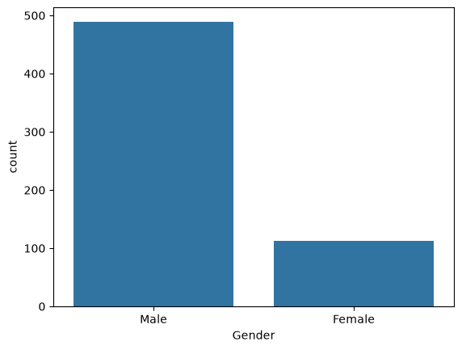
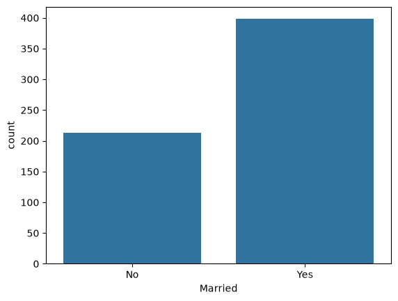
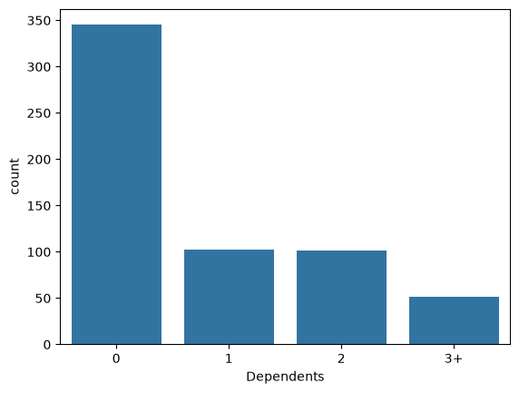
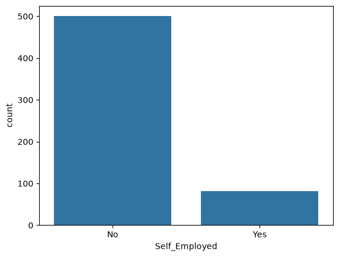
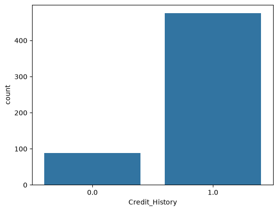
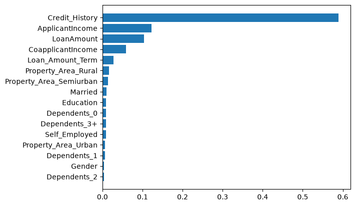

# Loan Approval Prediction

A machine learning project that predicts whether a loan application will be approved based on applicant details such as income, credit history, employment status, and property area.

## Overview

This project walks through a full classification pipeline — from raw data to a trained model — using a **Random Forest Classifier**. It covers exploratory data analysis, missing value imputation, feature engineering, and model evaluation.

## Project Workflow

1. **Data Gathering** – Load the raw loan applicant dataset
2. **EDA** – Explore and understand the data
3. **Missing Value Imputation** – Handle nulls in `Gender`, `Married`, `Dependents`, `Self_Employed`, `LoanAmount`, `Loan_Amount_Term`, and `Credit_History`
4. **Feature Creation** – Engineer features for modeling
5. **Train/Test Split** – One-hot encode categorical columns (`Property_Area`, `Dependents`) and split the data
6. **Model Fitting & Evaluation** – Train a Random Forest Classifier and evaluate performance
7. **Feature Importance** – Visualize which features most influence loan approval decisions

## Exploratory Data Analysis

A quick look at the distribution of key applicant attributes:

<table>
  <tr>
    <td></td>
    <td></td>
  </tr>
  <tr>
    <td></td>
    <td></td>
  </tr>
  <tr>
    <td colspan="2" align="center"></td>
  </tr>
</table>

## Results

The Random Forest model achieved:

| Metric | Score |
|---|---|
| **Accuracy** | 82.1% |
| Precision (Approved) | 0.82 |
| Recall (Approved) | 0.97 |
| F1-score (Approved) | 0.89 |

**Confusion Matrix:**
```
[[14 19]
 [ 3 87]]
```

The model performs strongly at identifying approved loans (high recall), though it's more conservative when flagging rejections — worth keeping in mind if this were extended toward production use.

### Feature Importance



`Credit_History` is by far the strongest predictor of loan approval, consistent with real-world lending practices.

## Tech Stack

- **Python 3**
- **pandas** & **numpy** – data manipulation
- **scikit-learn** – model training & evaluation (Random Forest Classifier)
- **seaborn** & **matplotlib** – visualization

## Getting Started

### Prerequisites
```bash
pip install numpy pandas scikit-learn seaborn matplotlib
```

### Running the notebook
```bash
jupyter notebook "Loan Approval Prediction.ipynb"
```

> **Note:** The dataset path is currently hardcoded to a local file (`Finance.csv`). Update the path in the data-loading cell to point to your own copy of the dataset before running.

## Repository Structure
```
├── Loan Approval Prediction.ipynb   # Main notebook
├── LICENSE                          # MIT License
└── README.md
```

## License

This project is licensed under the MIT License — see the [LICENSE](LICENSE) file for details.
